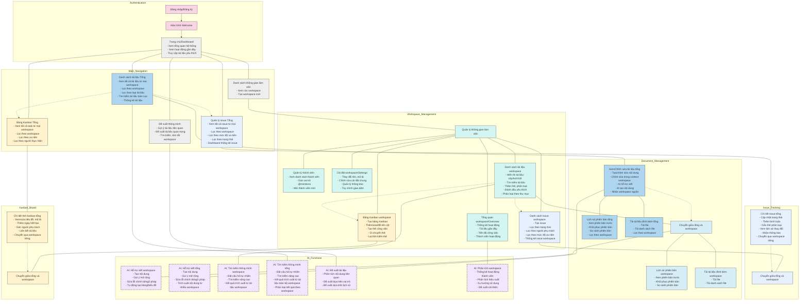

```mermaid
flowchart TD
    subgraph Authentication
        A[Đăng nhập/Đăng ký] --> B[Màn hình Welcome]
        B --> C
    end
    
    subgraph Main_Navigation
        C[Trang chủ/Dashboard<br>- Xem tổng quan hệ thống<br>- Xem hoạt động gần đây<br>- Truy cập tài liệu yêu thích] --- D[Danh sách không gian làm việc<br>- Xem các workspace<br>- Tạo workspace mới]
        C --- E[Đề xuất thông minh<br>- Gợi ý tài liệu liên quan<br>- Đề xuất tài liệu quan trọng<br>- Tìm kiếm, tóm tắt workspace]
        C --- K_Global[Bảng Kanban Tổng<br>- Xem tất cả task từ mọi workspace<br>- Lọc theo workspace<br>- Lọc theo ưu tiên<br>- Lọc theo người thực hiện]
        C --- M_Global[Quản lý Issue Tổng<br>- Xem tất cả issue từ mọi workspace<br>- Lọc theo workspace<br>- Lọc theo mức độ ưu tiên<br>- Lọc theo trạng thái<br>- Dashboard thống kê issue]
        C --- G_Global[Danh sách tài liệu Tổng<br>- Xem tất cả tài liệu từ mọi workspace<br>- Lọc theo workspace<br>- Lọc theo loại tài liệu<br>- Tìm kiếm tài liệu toàn cục<br>- Thống kê tài liệu]
    end
    
    subgraph Workspace_Management
        D --- F[Quản lý không gian làm việc]
        F --- F0[Tổng quan workspace/Overview<br>- Thống kê hoạt động<br>- Tài liệu gần đây<br>- Tiến độ công việc<br>- Thành viên hoạt động]
        F --- F1[Quản lý thành viên<br>- Xem danh sách thành viên<br>- Gán vai trò<br>- @mentions<br>- Mời thành viên mới]
        F --- F2[Cài đặt workspace/Settings<br>- Thay đổi tên, mô tả<br>- Chỉnh sửa cài đặt chung<br>- Quản lý thông báo<br>- Tùy chỉnh giao diện]
        F --- K_WS[Bảng Kanban workspace<br>- Tạo bảng Kanban<br>- Thêm/xóa/đổi tên cột<br>- Tạo thẻ công việc<br>- Di chuyển thẻ<br>- Lọc/tìm kiếm thẻ]
        F --- M_WS[Danh sách Issue workspace<br>- Tạo issue<br>- Lọc theo trạng thái<br>- Lọc theo người phụ trách<br>- Lọc theo mức độ ưu tiên<br>- Thống kê issue workspace]
        F --- G_WS[Danh sách tài liệu workspace<br>- Hiển thị tài liệu: cây/lưới/cột<br>- Tìm kiếm tài liệu<br>- Thêm thẻ, phân loại<br>- Đánh dấu yêu thích<br>- Phân loại theo thư mục]
    end
    
    subgraph Document_Management
        G_Global --- H_Global[Xem/Chỉnh sửa tài liệu tổng<br>- Tạo/chỉnh sửa nội dung<br>- Chỉnh sửa trong context workspace<br>- AI hỗ trợ viết<br>- AI tạo nội dung<br>- Nhãn workspace nguồn]
        G_WS --- H_WS[Xem/Chỉnh sửa tài liệu workspace<br>- Tạo/chỉnh sửa nội dung<br>- Định dạng tài liệu<br>- AI hỗ trợ viết<br>- AI tạo nội dung<br>- AI tóm tắt nội dung]
        H_Global --- I_Global[Lịch sử phiên bản tổng<br>- Xem phiên bản trước<br>- Khôi phục phiên bản<br>- So sánh phiên bản<br>- Lọc theo workspace]
        H_WS --- I_WS[Lịch sử phiên bản workspace<br>- Xem phiên bản trước<br>- Khôi phục phiên bản<br>- So sánh phiên bản]
        H_Global --- J_Global[Tải tài liệu đính kèm tổng<br>- Tải file<br>- Tải danh sách file<br>- Lọc theo workspace]
        H_WS --- J_WS[Tải tài liệu đính kèm workspace<br>- Tải file<br>- Tải danh sách file]
    end
    
    subgraph Kanban_Board
        K_Global --- L_Global[Chi tiết thẻ Kanban tổng<br>- Xem/sửa tiêu đề, mô tả<br>- Thêm ngày hết hạn<br>- Gán người phụ trách<br>- Liên kết tài liệu<br>- Chuyển qua workspace riêng]
        K_WS --- L_WS[Chi tiết thẻ Kanban workspace<br>- Xem/sửa tiêu đề, mô tả<br>- Thêm ngày hết hạn<br>- Gán người phụ trách<br>- Liên kết tài liệu workspace]
    end
    
    subgraph Issue_Tracking
        M_Global --- N_Global[Chi tiết Issue tổng<br>- Cập nhật trạng thái<br>- Thêm bình luận<br>- Gắn thẻ phân loại<br>- Xem lịch sử thay đổi<br>- Nhận thông báo<br>- Chuyển qua workspace riêng]
        M_WS --- N_WS[Chi tiết Issue workspace<br>- Cập nhật trạng thái<br>- Thêm bình luận<br>- Gắn thẻ phân loại<br>- Xem lịch sử thay đổi<br>- Nhận thông báo]
    end
    
    %% AI Integration points
    subgraph AI_Functions
        O_WS[AI: Hỗ trợ viết workspace<br>- Tạo nội dung<br>- Gợi ý mở rộng<br>- Sửa lỗi chính tả/ngữ pháp<br>- Tự động tạo bảng/biểu đồ]
        O_Global[AI: Hỗ trợ viết tổng<br>- Tạo nội dung<br>- Gợi ý mở rộng<br>- Sửa lỗi chính tả/ngữ pháp<br>- Trích xuất nội dung từ nhiều workspace]
        P_WS[AI: Tìm kiếm thông minh workspace<br>- Đặt câu hỏi tự nhiên<br>- Tìm kiếm nâng cao<br>- Kết quả trích xuất từ tài liệu workspace]
        P_Global[AI: Tìm kiếm thông minh tổng<br>- Đặt câu hỏi tự nhiên<br>- Tìm kiếm nâng cao<br>- Kết quả trích xuất từ tài liệu toàn bộ workspace<br>- Phân loại kết quả theo workspace]
        Q[AI: Đề xuất tài liệu<br>- Phân tích nội dung liên quan<br>- Đề xuất dựa trên vai trò<br>- Đề xuất dựa trên lịch sử]
        R[AI: Phân tích workspace<br>- Thống kê hoạt động thành viên<br>- Phân tích hiệu suất<br>- Xu hướng sử dụng<br>- Đề xuất cải thiện]
    end
    
    %% Connections between sections
    H_WS --- O_WS
    H_Global --- O_Global
    G_WS --- P_WS
    G_Global --- P_Global
    E --- Q
    F0 --- R
    G_WS -.-> K_WS
    G_WS -.-> M_WS
    G_Global -.-> K_Global
    G_Global -.-> M_Global
    L_Global -.-> L_WS[Chuyển giữa tổng và workspace]
    N_Global -.-> N_WS[Chuyển giữa tổng và workspace]
    H_Global -.-> H_WS[Chuyển giữa tổng và workspace]
    
    %% Function legend
    classDef auth fill:#f9d5e5,stroke:#333,stroke-width:1px
    classDef main fill:#eeeeee,stroke:#333,stroke-width:1px
    classDef workspace fill:#d3f6f3,stroke:#333,stroke-width:1px
    classDef document fill:#d7eef6,stroke:#333,stroke-width:1px
    classDef document_global fill:#aed6f1,stroke:#333,stroke-width:1px
    classDef kanban fill:#fff2cc,stroke:#333,stroke-width:1px
    classDef issue fill:#e6f0ff,stroke:#333,stroke-width:1px
    classDef ai fill:#f2e6ff,stroke:#333,stroke-width:2px,stroke-dasharray: 5 5
    
    class A,B auth
    class C,D,E,K_Global,M_Global,G_Global main
    class F,F0,F1,F2,K_WS,M_WS,G_WS workspace
    class H_WS,I_WS,J_WS document
    class G_Global,H_Global,I_Global,J_Global document_global
    class K_Global,K_WS,L_Global,L_WS kanban
    class M_Global,M_WS,N_Global,N_WS issue
    class O_WS,O_Global,P_WS,P_Global,Q,R ai
``` 