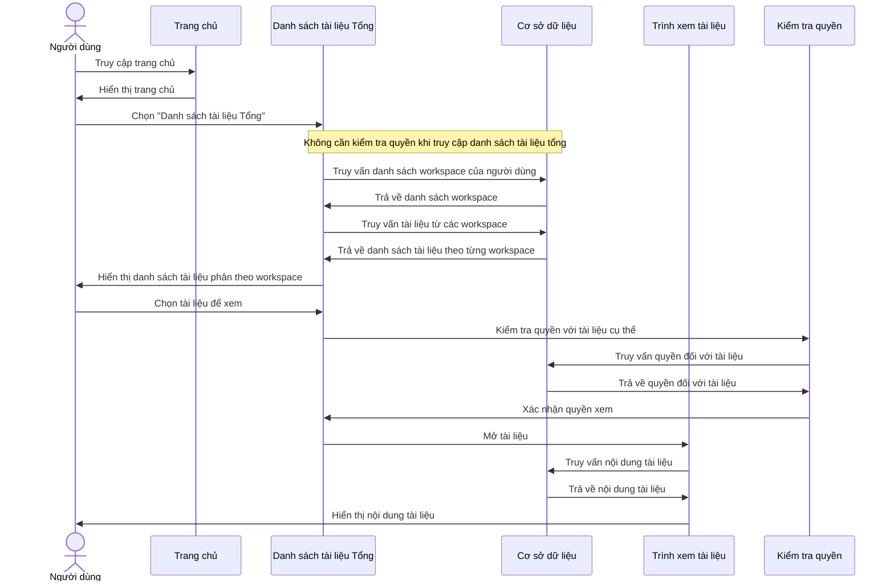
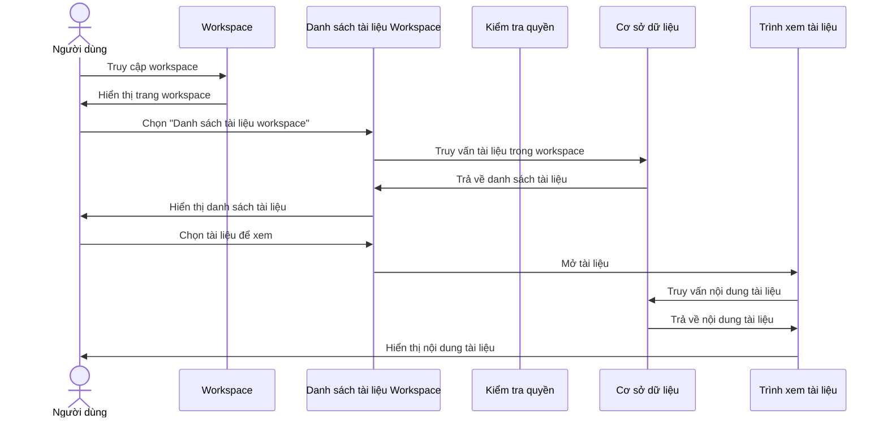
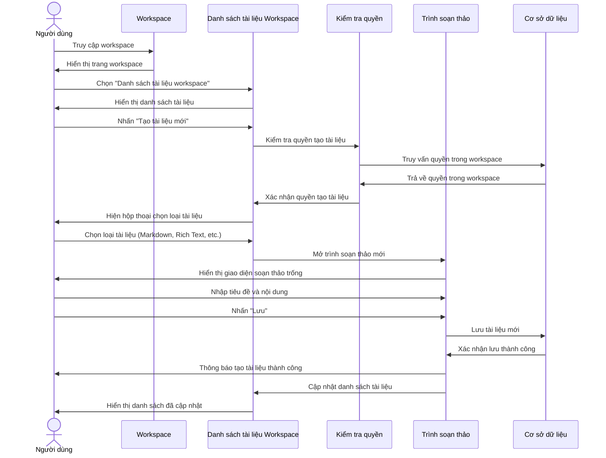
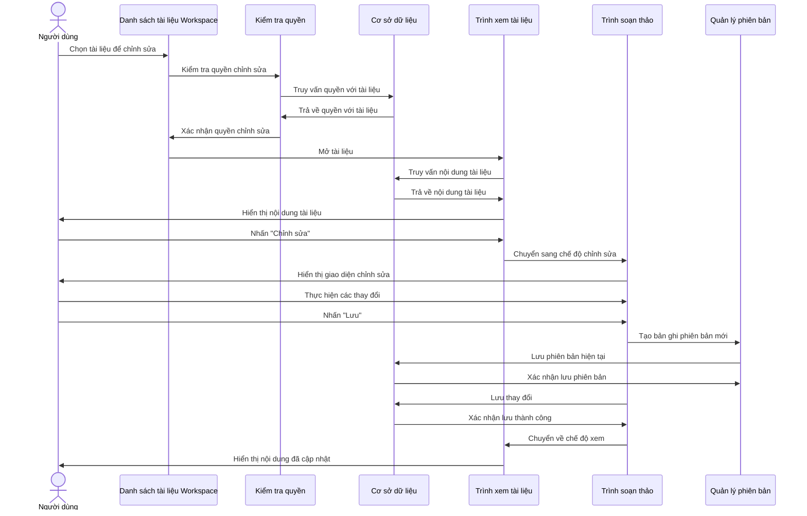
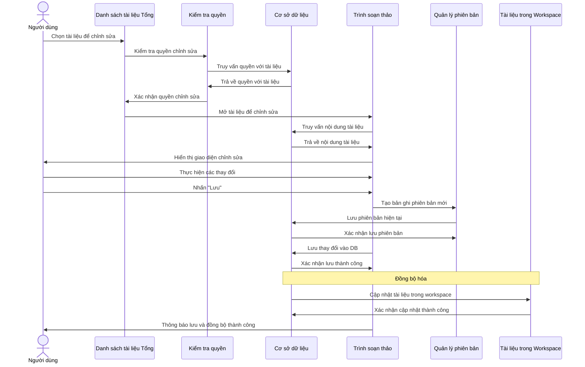
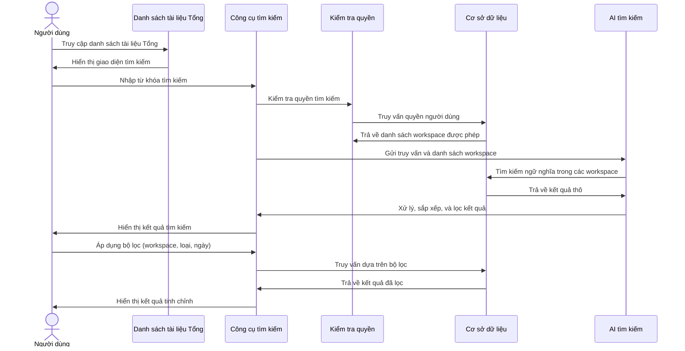
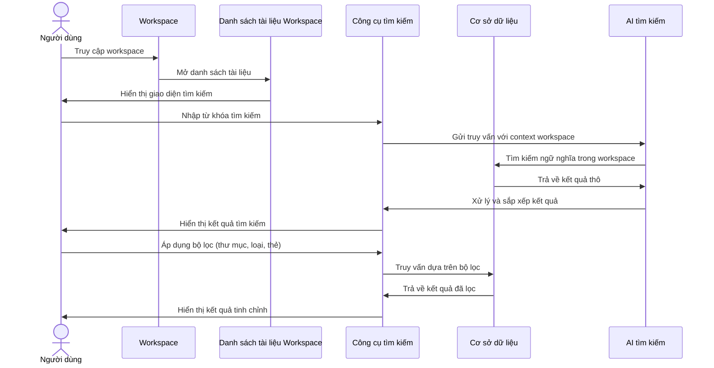
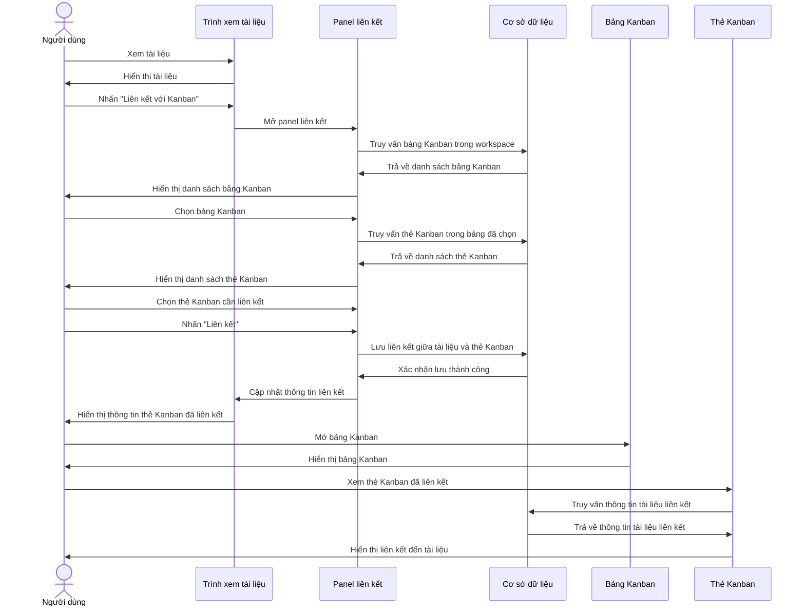
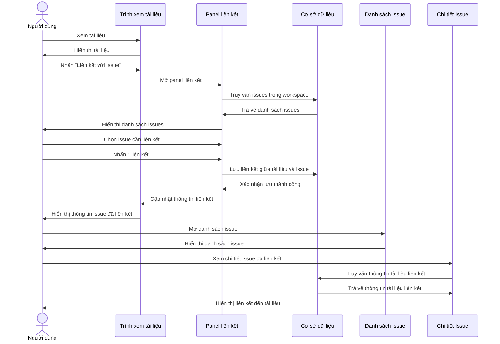
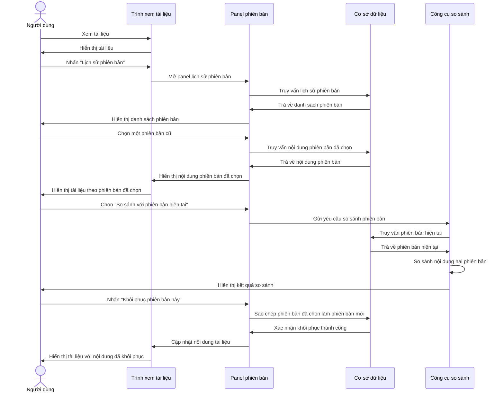

# Biểu đồ Sequence cho Chức năng Tài liệu

Tài liệu này chứa các biểu đồ tuần tự (sequence diagram) mô tả các luồng xử lý chính liên quan đến quản lý tài liệu trong hệ thống. Biểu đồ được phân chia theo các chức năng khác nhau từ việc xem, tạo, chỉnh sửa đến tìm kiếm và sử dụng AI với tài liệu.

## Vai trò trong Hệ thống (System Roles)

Hệ thống có 3 vai trò chính:

1. **System Admin**: Có toàn quyền quản lý hệ thống, tất cả workspace và người dùng.
   - Truy cập tất cả tài liệu trong hệ thống
   - Quản lý người dùng và phân quyền
   - Tạo, sửa, xóa workspace và cài đặt hệ thống

2. **Manager**: Có quyền quản lý một số workspace và chức năng hệ thống giới hạn.
   - Quản lý các workspace được gán
   - Phân quyền cho thành viên trong workspace được quản lý
   - Kiểm soát tài liệu, task và issue trong phạm vi quản lý

3. **Member**: Người dùng thông thường với các quyền cơ bản.
   - Truy cập workspace và tài liệu được phân quyền
   - Tạo và chỉnh sửa tài liệu trong phạm vi được cấp quyền
   - Tham gia xử lý task và issue được giao

## 1. Xem Tài liệu

### 1.1. Xem tất cả Tài liệu (Global)

### 1.2. Xem Tài liệu Workspace

## 2. Tạo Tài liệu Mới

## 3. Chỉnh sửa Tài liệu

### 3.1. Chỉnh sửa Tài liệu Workspace

### 3.2. Chỉnh sửa Tài liệu Tổng và Đồng bộ

## 4. Tìm kiếm Tài liệu

### 4.1. Tìm kiếm Tài liệu Tổng

### 4.2. Tìm kiếm Tài liệu Workspace

## 6. Liên kết Tài liệu với Kanban và Issue

### 6.1. Liên kết Tài liệu với Thẻ Kanban

### 6.2. Liên kết Tài liệu với Issue

## 7. Quản lý Phiên bản Tài liệu

