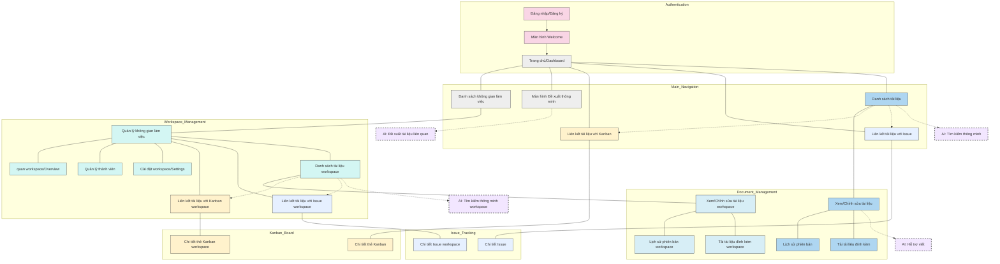

```mermaid
flowchart TD
    subgraph Authentication
        A[Đăng nhập/Đăng ký] --> B[Màn hình Welcome]
        B --> C
    end
    
    subgraph Main_Navigation
        C[Trang chủ/Dashboard] --- D[Danh sách không gian làm việc]
        C --- E[Màn hình Đề xuất thông minh]
        C --- K_Global[Bảng Kanban ]
        C --- M_Global[Quản lý Issue ]
        C --- G_Global[Danh sách tài liệu ]
    end
    
    subgraph Workspace_Management
        D --- F[Quản lý không gian làm việc]
        F --- F0[ quan workspace/Overview]
        F --- F1[Quản lý thành viên]
        F --- F2[Cài đặt workspace/Settings]
        F --- K_WS[Bảng Kanban workspace]
        F --- M_WS[Danh sách Issue workspace]
        F --- G_WS[Danh sách tài liệu workspace]
    end
    
    subgraph Document_Management
        G_Global --- H_Global[Xem/Chỉnh sửa tài liệu ]
        G_WS --- H_WS[Xem/Chỉnh sửa tài liệu workspace]
        H_Global --- I_Global[Lịch sử phiên bản ]
        H_WS --- I_WS[Lịch sử phiên bản workspace]
        H_Global --- J_Global[Tải tài liệu đính kèm ]
        H_WS --- J_WS[Tải tài liệu đính kèm workspace]
    end
    
    subgraph Kanban_Board
        K_Global --- L_Global[Chi tiết thẻ Kanban ]
        K_WS --- L_WS[Chi tiết thẻ Kanban workspace]
    end
    
    subgraph Issue_Tracking
        M_Global --- N_Global[Chi tiết Issue ]
        M_WS --- N_WS[Chi tiết Issue workspace]
    end
    
    %% Connections between sections
    G_WS -.-> K_WS[Liên kết tài liệu với Kanban workspace]
    G_WS -.-> M_WS[Liên kết tài liệu với Issue workspace]
    G_Global -.-> K_Global[Liên kết tài liệu  với Kanban ]
    G_Global -.-> M_Global[Liên kết tài liệu  với Issue ]
    
    %% AI Integration points
    H_Global -.-> O_Global[AI: Hỗ trợ viết ]
    G_WS -.-> P_WS[AI: Tìm kiếm thông minh workspace]
    G_Global -.-> P_Global[AI: Tìm kiếm thông minh ]
    E -.-> Q[AI: Đề xuất tài liệu liên quan]
    
    %% Function legend
    classDef auth fill:#f9d5e5,stroke:#333,stroke-width:1px
    classDef main fill:#eeeeee,stroke:#333,stroke-width:1px
    classDef workspace fill:#d3f6f3,stroke:#333,stroke-width:1px
    classDef document fill:#d7eef6,stroke:#333,stroke-width:1px
    classDef document_global fill:#aed6f1,stroke:#333,stroke-width:1px
    classDef kanban fill:#fff2cc,stroke:#333,stroke-width:1px
    classDef issue fill:#e6f0ff,stroke:#333,stroke-width:1px
    classDef ai fill:#f2e6ff,stroke:#333,stroke-width:2px,stroke-dasharray: 5 5
    
    class A,B auth
    class C,D,E,K_Global,M_Global,G_Global main
    class F,F0,F1,F2,K_WS,M_WS,G_WS workspace
    class H_WS,I_WS,J_WS document
    class G_Global,H_Global,I_Global,J_Global document_global
    class K_Global,K_WS,L_Global,L_WS kanban
    class M_Global,M_WS,N_Global,N_WS issue
    class O_WS,O_Global,P_WS,P_Global,Q,R ai
```