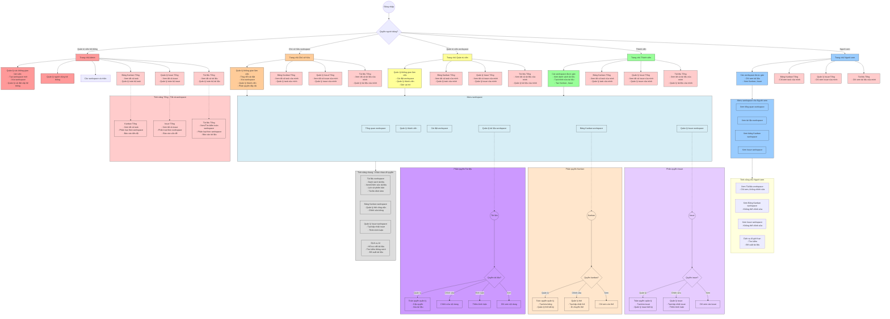

```mermaid
flowchart TD
    Start((Đăng nhập)) --> CheckRole{Quyền người dùng?}
    
    %% System Admin Flow
    CheckRole -->|Quản trị viên hệ thống| AdminHome[Trang chủ Admin]
    AdminHome --> ManageWorkspaces[Quản lý các không gian làm việc<br>- Tạo workspace mới<br>- Xóa workspace<br>- Quản lý cài đặt cấp hệ thống]
    AdminHome --> ManageUsers[Quản lý người dùng hệ thống]
    AdminHome --> ViewOwnWorkspaces[Các workspace cá nhân]
    AdminHome --> GlobalKanban[Bảng Kanban Tổng<br>- Xem tất cả task<br>- Quản lý toàn bộ task]
    AdminHome --> GlobalIssue[Quản lý Issue Tổng<br>- Xem tất cả issue<br>- Quản lý toàn bộ issue]
    AdminHome --> GlobalDocs[Tài liệu Tổng<br>- Xem tất cả tài liệu<br>- Quản lý toàn bộ tài liệu]
    
    %% Workspace Owner Flow
    CheckRole -->|Chủ sở hữu workspace| OwnerHome[Trang chủ Chủ sở hữu]
    OwnerHome --> ManageOneWorkspace[Quản lý không gian làm việc<br>- Thay đổi cài đặt<br>- Xóa workspace<br>- Quản lý thành viên<br>- Phân quyền đầy đủ]
    OwnerHome --> OwnerGlobalKanban[Bảng Kanban Tổng<br>- Xem tất cả task của mình<br>- Quản lý task của mình]
    OwnerHome --> OwnerGlobalIssue[Quản lý Issue Tổng<br>- Xem tất cả issue của mình<br>- Quản lý issue của mình]
    OwnerHome --> OwnerGlobalDocs[Tài liệu Tổng<br>- Xem tất cả tài liệu của mình<br>- Quản lý tài liệu của mình]
    
    %% Workspace Admin Flow
    CheckRole -->|Quản trị viên workspace| AdminWS[Trang chủ Quản trị viên]
    AdminWS --> AdminWorkspace[Quản lý không gian làm việc<br>- Cài đặt workspace<br>- Quản lý thành viên<br>- Gán vai trò]
    AdminWS --> AdminGlobalKanban[Bảng Kanban Tổng<br>- Xem tất cả task của mình<br>- Quản lý task của mình]
    AdminWS --> AdminGlobalIssue[Quản lý Issue Tổng<br>- Xem tất cả issue của mình<br>- Quản lý issue của mình]
    AdminWS --> AdminGlobalDocs[Tài liệu Tổng<br>- Xem tất cả tài liệu của mình<br>- Quản lý tài liệu của mình]
    
    %% Member Flow
    CheckRole -->|Thành viên| MemberHome[Trang chủ Thành viên]
    MemberHome --> MemberWorkspace[Các workspace được gán<br>- Xem danh sách tài liệu<br>- Tạo/chỉnh sửa tài liệu<br>- Tạo Kanban, Issue]
    MemberHome --> MemberGlobalKanban[Bảng Kanban Tổng<br>- Xem tất cả task của mình<br>- Quản lý task của mình]
    MemberHome --> MemberGlobalIssue[Quản lý Issue Tổng<br>- Xem tất cả issue của mình<br>- Quản lý issue của mình]
    MemberHome --> MemberGlobalDocs[Tài liệu Tổng<br>- Xem tất cả tài liệu của mình<br>- Quản lý tài liệu của mình]
    
    %% Viewer Flow
    CheckRole -->|Người xem| ViewerHome[Trang chủ Người xem]
    ViewerHome --> ViewerWorkspace[Các workspace được gán<br>- Chỉ xem tài liệu<br>- Xem Kanban, Issue]
    ViewerHome --> ViewerGlobalKanban[Bảng Kanban Tổng<br>- Chỉ xem task của mình]
    ViewerHome --> ViewerGlobalIssue[Quản lý Issue Tổng<br>- Chỉ xem issue của mình]
    ViewerHome --> ViewerGlobalDocs[Tài liệu Tổng<br>- Chỉ xem tài liệu của mình]
    
    %% Workspace Menu Structure
    ManageOneWorkspace --> WorkspaceMenu
    AdminWorkspace --> WorkspaceMenu
    MemberWorkspace --> WorkspaceMenu
    ViewerWorkspace --> ViewerMenu
    
    subgraph WorkspaceMenu[Menu workspace]
        WSOverview[Tổng quan workspace]
        WSMembers[Quản lý thành viên]
        WSSettings[Cài đặt workspace]
        WSDocuments[Quản lý tài liệu workspace]
        WSKanban[Bảng Kanban workspace]
        WSIssues[Quản lý Issue workspace]
    end
    
    subgraph ViewerMenu[Menu workspace cho Người xem]
        VSOverview[Xem tổng quan workspace]
        VSDocuments[Xem tài liệu workspace]
        VSKanban[Xem bảng Kanban workspace]
        VSIssues[Xem Issue workspace]
    end
    
    %% Common Features
    WorkspaceMenu --> CommonFeatures
    ViewerMenu --> ViewerFeatures
    
    %% Common Features Subgraph
    subgraph CommonFeatures[Tính năng chung - Khác nhau về quyền]
        Documents[Tài liệu workspace<br>- Danh sách tài liệu<br>- Xem/Chỉnh sửa tài liệu<br>- Lịch sử phiên bản<br>- Tải file đính kèm]
        KanbanBoards[Bảng Kanban workspace<br>- Quản lý thẻ công việc<br>- Chỉnh sửa bảng]
        IssueTracking[Quản lý Issue workspace<br>- Tạo/cập nhật issue<br>- Thêm bình luận]
        AIServices[Dịch vụ AI<br>- Hỗ trợ viết tài liệu<br>- Tìm kiếm thông minh<br>- Đề xuất tài liệu]
    end
    
    %% Viewer Features Subgraph
    subgraph ViewerFeatures[Tính năng cho Người xem]
        ViewDocuments[Xem Tài liệu workspace<br>- Chỉ xem, không chỉnh sửa]
        ViewKanban[Xem Bảng Kanban workspace<br>- Không thể chỉnh sửa]
        ViewIssues[Xem Issue workspace<br>- Không thể chỉnh sửa]
        LimitedAI[Dịch vụ AI giới hạn<br>- Tìm kiếm<br>- Đề xuất tài liệu]
    end
    
    %% Global Feature Access
    subgraph GlobalFeatures[Tính năng Tổng - Tất cả workspace]
        GlobalDocsAccess[Tài liệu Tổng<br>- Xem/Tìm kiếm toàn workspace<br>- Phân loại theo workspace<br>- Báo cáo tài liệu]
        GlobalKanbanAccess[Kanban Tổng<br>- Xem tất cả task<br>- Phân loại theo workspace<br>- Báo cáo tiến độ]
        GlobalIssueAccess[Issue Tổng<br>- Xem tất cả issue<br>- Phân loại theo workspace<br>- Báo cáo vấn đề]
    end
    
    GlobalDocs -.-> GlobalDocsAccess
    GlobalKanban -.-> GlobalKanbanAccess
    GlobalIssue -.-> GlobalIssueAccess
    
    %% Connections
    subgraph KanbanAccess[Phân quyền Kanban]
        direction TB
        KanbanStart((Kanban)) --> KanbanCheck{Quyền kanban?}
        KanbanCheck -->|Quản lý| ManageKanban[Toàn quyền quản lý<br>- Tạo/xóa bảng<br>- Quản lý thẻ bất kỳ]
        KanbanCheck -->|Chỉnh sửa| EditKanban[Quản lý thẻ<br>- Tạo/cập nhật thẻ<br>- Di chuyển thẻ]
        KanbanCheck -->|Xem| ViewKanbanOnly[Chỉ xem các thẻ]
    end
    
    %% Connections
    subgraph IssueAccess[Phân quyền Issue]
        direction TB
        IssueStart((Issue)) --> IssueCheck{Quyền issue?}
        IssueCheck -->|Quản lý| ManageIssue[Toàn quyền quản lý<br>- Tạo/xóa issue<br>- Quản lý issue bất kỳ]
        IssueCheck -->|Chỉnh sửa| EditIssue[Quản lý issue<br>- Tạo/cập nhật issue<br>- Thêm bình luận]
        IssueCheck -->|Xem| ViewIssueOnly[Chỉ xem các issue]
    end
    
    WSDocuments -.-> DocStart
    WSKanban -.-> KanbanStart
    WSIssues -.-> IssueStart
    
    %% Document Access Controls
    subgraph DocumentAccess[Phân quyền Tài liệu]
        direction TB
        DocStart((Tài liệu)) --> DocCheck{Quyền tài liệu?}
        DocCheck -->|Quản lý| ManageDoc[Toàn quyền quản lý<br>- Cấp quyền<br>- Xóa tài liệu]
        DocCheck -->|Chỉnh sửa| EditDoc[Chỉnh sửa nội dung]
        DocCheck -->|Bình luận| CommentDoc[Thêm bình luận]
        DocCheck -->|Xem| ViewDoc[Chỉ xem nội dung]
    end
    
    %% Style definitions
    classDef admin fill:#ff9999,stroke:#333,stroke-width:1px
    classDef owner fill:#ffcc99,stroke:#333,stroke-width:1px
    classDef wsadmin fill:#ffff99,stroke:#333,stroke-width:1px
    classDef member fill:#99ff99,stroke:#333,stroke-width:1px
    classDef viewer fill:#99ccff,stroke:#333,stroke-width:1px
    classDef common fill:#dddddd,stroke:#333,stroke-width:1px
    classDef docaccess fill:#cc99ff,stroke:#333,stroke-width:1px
    classDef kanbanaccess fill:#ffe6cc,stroke:#333,stroke-width:1px
    classDef issueaccess fill:#e6ccff,stroke:#333,stroke-width:1px
    classDef wsmenu fill:#d7eef6,stroke:#333,stroke-width:1px
    classDef global fill:#ffcccc,stroke:#333,stroke-width:1px
    
    class AdminHome,ManageWorkspaces,ManageUsers admin
    class OwnerHome,ManageOneWorkspace owner
    class AdminWS,AdminWorkspace wsadmin
    class MemberHome,MemberWorkspace member
    class ViewerHome,ViewerWorkspace,ViewerMenu,VSOverview,VSDocuments,VSKanban,VSIssues viewer
    class CommonFeatures,Documents,KanbanBoards,IssueTracking,AIServices common
    class DocumentAccess,DocStart,DocCheck,ManageDoc,EditDoc,CommentDoc,ViewDoc docaccess
    class KanbanAccess,KanbanStart,KanbanCheck,ManageKanban,EditKanban,ViewKanbanOnly kanbanaccess
    class IssueAccess,IssueStart,IssueCheck,ManageIssue,EditIssue,ViewIssueOnly issueaccess
    class WorkspaceMenu,WSOverview,WSMembers,WSSettings,WSDocuments,WSKanban,WSIssues wsmenu
    class GlobalKanban,GlobalIssue,GlobalDocs,OwnerGlobalKanban,OwnerGlobalIssue,OwnerGlobalDocs,AdminGlobalKanban,AdminGlobalIssue,AdminGlobalDocs,MemberGlobalKanban,MemberGlobalIssue,MemberGlobalDocs,ViewerGlobalKanban,ViewerGlobalIssue,ViewerGlobalDocs,GlobalFeatures,GlobalDocsAccess,GlobalKanbanAccess,GlobalIssueAccess global
``` 